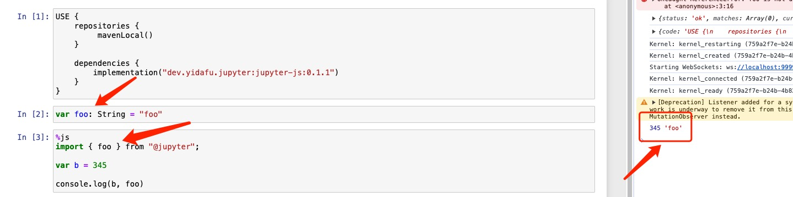

# kotlin-notebook-js

Jupyter Kotlin Kernel support `%js`/`%ts`/`%jsx`/`%tsx` line magics.

This Project still in early stage.

## Screen Snapshot

## TODO LIST

+ [x] swc binding for compile js code
+ [x] `%js`/`%ts`magics
+ [ ] `%jsx`/`%tsx` magic
+ [ ] import variable from Kotlin world. like this: `import { foo } from "@jupyter"`
+ [ ] js syntax highlight
+ [ ] etc...