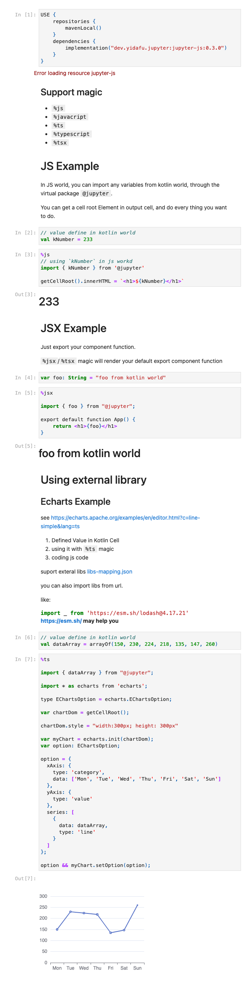

# kotlin-notebook-js

Jupyter Kotlin Kernel support `%js`/`%ts`/`%jsx`/`%tsx` line magics.

This Project still in early stage.

## Screenshot

see [examples//js-magic.ipynb](./examples//js-magic.ipynb)

## TODO LIST

+ [x] swc binding for compile js code
+ [x] `%js`/`%ts`magics
+ [x] `%jsx`/`%tsx` magic
+ [x] import variable from Kotlin world. like this: `import { foo } from "@jupyter"`
+ [ ] js syntax highlight
+ [ ] etc...
