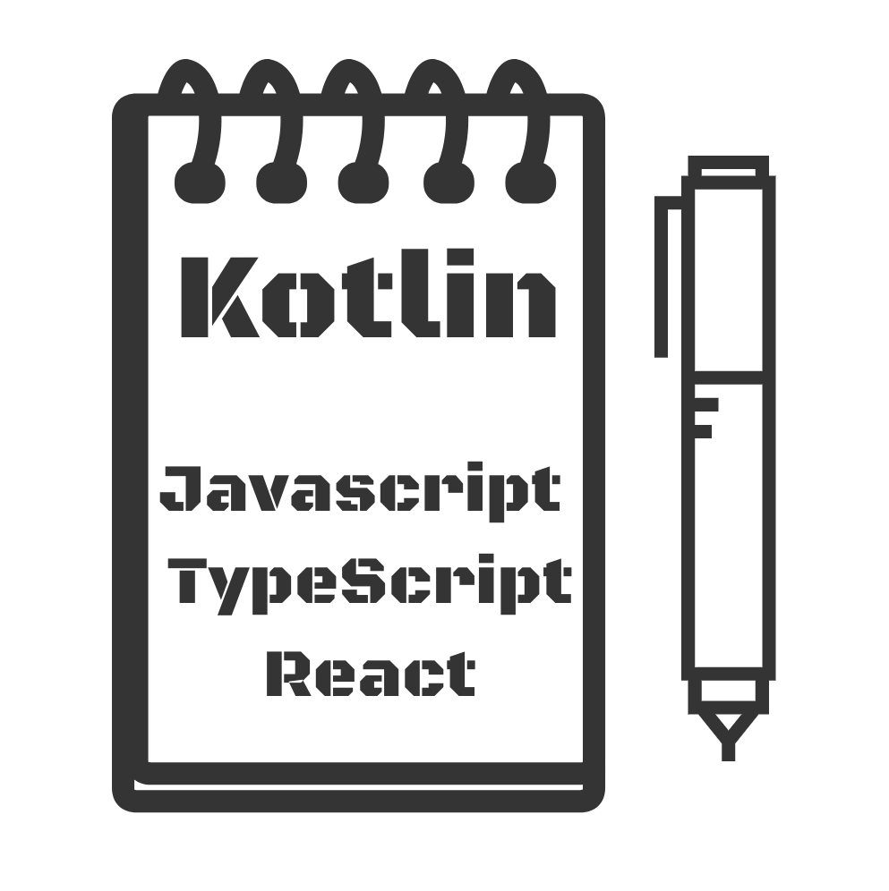

[](https://kotlinlang.org/docs/components-stability.html)
[](https://search.maven.org/search?q=kotlin-jupyter)
[](https://www.apache.org/licenses/LICENSE-2.0)


<div style="display:flex;margin: 24px">
    
</div>

# kotlin-notebook-js

Jupyter Kotlin Kernel support for `%js`/`%ts`/`%jsx`/`%tsx` line magics, enabling seamless integration between Kotlin and JavaScript/TypeScript in Jupyter notebooks.

## Features

+ ✨ Import any variable from Kotlin world via virtual package `@jupyter`
+ 🚀 Support **JavaScript** / **TypeScript** / **React** (JSX/TSX)
+ 📦 Inline script import (local and remote with `?inline` parameter)
+ 🌐 NPM package support via CDN (ES modules)
+ 📚 Built-in library mappings for 100+ popular packages
+ ⚙️ Configuration DSL for custom library mappings
+ 🛡️ Comprehensive error handling and formatting
+ 🔄 Variable aliasing with `jsExport`
+ 📊 Rich visualization support (ECharts, D3, Chart.js, etc.)

## Support magic

+ `%js`
+ `%javascript`
+ `%jsx`
+ `%ts`
+ `%typescript`
+ `%tsx`

## Requirements

- Kotlin Jupyter Kernel (latest dev version recommended)
- Jupyter Notebook or JupyterLab
- Java 17+ (for building from source)

## Installation

### Import The Library First

Latest dev jupyter kotlin kernel support `%use` magic.

```kotlin
%use jupyter-js
```

For old version, you have to using `USE {}` block.

```kt
USE {
    repositories {
        mavenCentral()

        maven("https://s01.oss.sonatype.org/content/groups/public/")
    }

    dependencies {
        implementation("dev.yidafu.jupyter:jupyter-js:0.8.0")
    }
}
```

### JS Example

In JS world, you can import any variables from kotlin world, through the virtual package `@jupyter`.

You can call `getCellRoot()` to get a `div` element in output cell, and then do every thing you want to do.

+ [Baics Usage](https://yidafu.github.io/kotlin-jupyter-js/examples/js-magic.html)
+ [Echarts 3D Example](https://yidafu.github.io/kotlin-jupyter-js/examples/girls-last-tour.html)

#### first declare a variable in cell

```kt
// value define in kotlin world
val kNumber = 233
```

#### then, add a cell with `%js` magic

```js
%js
// using `kNumber` in js workd
import { kNumber } from '@jupyter'

getCellRoot().innerHTML = `<h1>${kNumber}</h1>`
```

##### screenshot


#### inline js script

In some case, you may want to reuse js script.

Jupyter JS support inline relative and remote script.

Inline script supports all feature as js script in cell.

you just import js script in local workspace, like: [example/local.js](./examples/local.js)

```js
%js
import { foo } from './local.js'

console.log(foo)
// ==> 123
```

Or you may want using some shared script online. Add `?inline` query parameter after url.

```js
%js
import { foo } from  "https://cdn.jsdelivr.net/gh/yidafu/kotlin-jupyter-js@main/examples/local.js?inline"

console.log(foo)
// ==> 123
```

### TypeScript Example

TypeScript support includes type checking, interfaces, and type-safe functions.

```ts
%ts
import { dataArray } from "@jupyter";

interface DataPoint {
    x: number;
    y: number;
}

const points: DataPoint[] = dataArray.map((val, idx) => ({
    x: idx,
    y: val
}));

console.log(points);
```

### React Example

Just export your component function. `%jsx`/`%tsx` magic will render your default export component function.

```jsx
%jsx

import { foo } from "@jupyter";

export default function App() {
    return <h1>{foo}</h1>
}
```

#### screenshot


### Using NPM Library

You may want using npm package? fine, JupyterJs will transform js code into `<script type="module">`. this means you can
import any script or package by http(s) link.

like this:

```js
%js
import _ from 'https://cdn.jsdelivr.net/npm/lodash-es@4.17.21/lodash.min.js';
```

**<https://esm.sh/> may help you**

Too long to Coding? JupyterJs also support import source replacement. JupyterJs will replace import source
which [libs-mapping.json](jupyter-js/src/main/resources/libs-mapping.json) contains into http(s) link

so, you can coding like this:

```js
%js
import _ from 'lodash';
```

### Built-in packages

The library includes pre-configured mappings for many popular packages. See: [libs-mapping.json](jupyter-js/src/main/resources/libs-mapping.json)

Popular packages include:
+ react, react-dom
+ lodash, ramda
+ echarts, d3, chart.js, highcharts
+ visjs, three.js, leaflet
+ axios, moment, dayjs
+ And many more...

Adding your favorite package? Submit a PR/Issue.

### Echarts Example

see <https://echarts.apache.org/examples/en/editor.html?c=line-simple&lang=ts>

1. Defined Value in Kotlin Cell

```kt
val dataArray = arrayOf(150, 230, 224, 218, 135, 147, 260)
```

2. using it with `%ts` magic, render to char

```js
%ts
import { dataArray } from "@jupyter";
import * as echarts from 'echarts';

type EChartsOption = echarts.EChartsOption;

var chartDom = getCellRoot();
chartDom.style = "width:300px; height: 300px"
var myChart = echarts.init(chartDom);
var option: EChartsOption;

option = {
  xAxis: {
    type: 'category',
    data: ['Mon', 'Tue', 'Wed', 'Thu', 'Fri', 'Sat', 'Sun']
  },
  yAxis: {
    type: 'value'
  },
  series: [
    {
      data: dataArray,
      type: 'line'
    }
  ]
};

option && myChart.setOption(option);
```

#### screenshot


### Kotlin variable alias

`jsExport` allows you to export Kotlin variables to JavaScript with custom names. Variables are automatically encoded to JSON strings.

```kotlin
val foo = "string"
// Export variable to JavaScript with alias "bar"
jsExport("bar", foo)
```

```js
%js
import { foo, bar } from '@jupyter';

console.log(foo == bar); // true
```

Full example see [examples/js-magic.ipynb](./examples/js-magic.ipynb)

## More Examples

The project includes comprehensive examples covering various use cases:

### Getting Started
- [00-getting-started.ipynb](./examples/00-getting-started.ipynb) - Basic TypeScript example
- [js-magic.ipynb](./examples/js-magic.ipynb) - JavaScript magic commands

### Visualization
- [echarts-basic-charts.ipynb](./examples/echarts-basic-charts.ipynb) - ECharts examples
- [01-statistical-charts.ipynb](./examples/01-statistical-charts.ipynb) - Chart.js statistical charts
- [d3-visualization.ipynb](./examples/d3-visualization.ipynb) - D3.js custom visualizations
- [girls-last-tour.ipynb](./examples/girls-last-tour.ipynb) - 3D ECharts example

### React & UI
- [react-jsx-basic.ipynb](./examples/react-jsx-basic.ipynb) - React JSX basics
- [react-tsx-basic.ipynb](./examples/react-tsx-basic.ipynb) - React TSX with TypeScript

### Utilities & Data
- [lodash-utilities.ipynb](./examples/lodash-utilities.ipynb) - Lodash utility functions
- [kotlin-js-data-exchange.ipynb](./examples/kotlin-js-data-exchange.ipynb) - Data exchange patterns
- [basic-typescript.ipynb](./examples/basic-typescript.ipynb) - TypeScript fundamentals

### Configuration
- [config-dsl-basic.ipynb](./examples/config-dsl-basic.ipynb) - Configuration DSL examples

### Testing
- [console-log-test.ipynb](./examples/console-log-test.ipynb) - Console.log redirection

View all examples online: [Examples Gallery](https://yidafu.github.io/kotlin-jupyter-js/)

## Error Handling

The library provides comprehensive error handling with user-friendly HTML error messages:

- **Syntax Errors** - Line and column information
- **Type Errors** - Expected vs actual type information
- **Network Errors** - URL and status code details
- **Variable Not Found** - Available variables suggestions
- **Configuration Errors** - Config key and value details
- **Compilation Errors** - Language-specific error details

Errors are automatically formatted and displayed in the notebook output.

## Articles

[How Kotlin Jupyter JS works? (English Translation)](./docs/how-kotlin-jupyter-work.md) - [中文原文](./docs/how-kotlin-jupyter-work.zh-CN.md)

## Documentation

- [Jupyter Kotlin Js API](https://yidafu.github.io/kotlin-jupyter-js/kt-docs/index.html) - Full API documentation
- [DSL Usage Examples](jupyter-js/DSL_USAGE_EXAMPLES.md) - Configuration DSL guide
- [Optimized Usage](jupyter-js/OPTIMIZED_USAGE.md) - Performance tips
- [Preset Libraries](jupyter-js/PRESET_LIBRARIES.md) - Available preset libraries
- [Scenario-Based Usage](jupyter-js/SCENARIO_BASED_USAGE.md) - Common scenarios
- [Examples README](./examples/README.md) - Examples documentation

## Contributing

Contributions are welcome! Here are some ways you can help:

1. **Report Issues** - Found a bug? Please open an issue
2. **Suggest Features** - Have an idea? Share it in discussions
3. **Add Libraries** - Submit PRs to add popular libraries to the built-in mappings
4. **Improve Documentation** - Help improve docs and examples
5. **Write Examples** - Create example notebooks for new use cases

### Development Setup

```bash
# Clone the repository
git clone https://github.com/yidafu/kotlin-jupyter-js.git
cd kotlin-jupyter-js

# Build the project
./gradlew build

# Publish to local Maven repository for testing
./gradlew publishToMavenLocal

# Run tests
./gradlew test
```

See [examples/README.md](./examples/README.md) for local development and debugging tips.

## FAQ

### Q: How do I use a library that's not in the built-in mappings?

A: You can use the configuration DSL to add custom library mappings:

```kotlin
jsConfig {
    dependencies("my-lib", "https://cdn.example.com/my-lib.js")
}
```

Or import directly via URL:

```js
%js
import { something } from 'https://cdn.example.com/my-lib.js';
```

### Q: Can I use npm packages?

A: Yes! You can use any npm package via CDN services like [esm.sh](https://esm.sh/) or [jsdelivr](https://www.jsdelivr.com/):

```js
%js
import _ from 'https://esm.sh/lodash';
```

### Q: How do I debug JavaScript errors?

A: Errors are automatically formatted and displayed in the notebook. You can also check the browser console for detailed error information.

### Q: Can I use TypeScript types?

A: Yes! Use `%ts` or `%tsx` magic commands. TypeScript code is compiled to JavaScript before execution.

### Q: How do I export Kotlin variables with custom names?

A: Use the `jsExport` function:

```kotlin
val data = listOf(1, 2, 3)
jsExport("myData", data)
```

Then import in JavaScript:

```js
%js
import { myData } from '@jupyter';
```

## License

This project is licensed under the Apache License 2.0 - see the [License](License) file for details.

## TODO LIST

+ [x] SWC binding for compiling JS/TS code
+ [x] `%js`/`%ts` magics
+ [x] `%jsx`/`%tsx` magic
+ [x] Import variable from Kotlin world: `import { foo } from "@jupyter"`
+ [x] Inline script import (local and remote)
+ [x] Library mapping configuration DSL
+ [x] Error handling and formatting
+ [ ] JS syntax highlighting
+ [ ] More built-in library mappings
+ [ ] etc...
