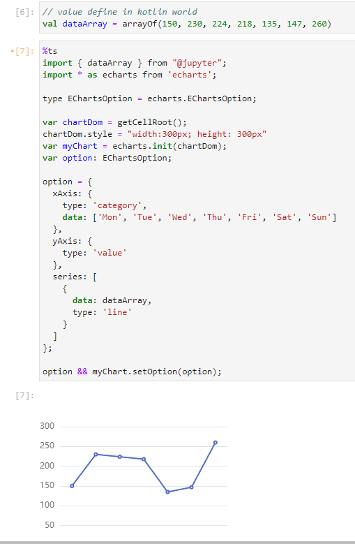

# How Kotlin Jupyter Js Works?

> Translated with DeepL.com (free version)

## Motivation

I need to understand blind watermarking for work, and this involves Fourier Transforms. I don't know anything about Fourier Transforms, so I thought I'd use Kotlin Jupyter to demonstrate Fourier Transforms in code step by step to aid my understanding. However, there is no library in Kotlin Jupyter to show 3D surfaces, and lets-plot seems to support only 2D charts.

After some trial and error, the only way to display 3D surfaces in Kotlin Jupyter is to use JS.Using JS in Kotlin Jupyter is more cumbersome. You need to convert kotlin variables to JSON strings, write the html code to be executed in the `HTML()` method, the container tag and the `<script>` tag.


```kotlin
// convert to JSON
var dataList = "[" + bList.map { "[${it.first}, ${it.second}, ${it.third}]" }.joinToString(",\n") + "]";

// render to html
HTML("""
<div id="chartDom" style="width: 600px; height: 600px;"> </div>
<script type="module">
import { init } from "https://unpkg.com/echarts@5.4.3/dist/echarts.esm.min.js"
import "https://unpkg.com/echarts-gl@2.0.9/dist/echarts-gl.min.js"

var chartDom = document.getElementById('chartDom');
var myChart = echarts.init(chartDom);
myChart.setOption({
  // echart option
})
</script>
""")
```

## Don't Repeat Yourself

You can see that the above example has several bits of boilerplate code

+ kotlin to Json
+ Creating the container `<div>` tag
+ Creating the `<script>` tag

Like `ipython` supports `%js` to write js directly, the code with `%js` tag is intercepted before cell execution and converted to the output cell inserted by the `<script />` tag.

At Kotlin Jupyter we also generate this stencil code through custom line magic. kotlin Jupyter already provides hooks ([kotlin-jupyter/docs/libaries.md](https://github.com/Kotlin/kotlin-jupyter/blob/master/docs/libraries.md)) for this, all we need to do is to write a `CodePreprocessor` that intercepts the code containing `%js` and converts it to `HTML` function calls.

For example the following:


```js
%js
var hello = "hellow jupyter js"

console.log(hello)
```

It needs to be converted to

```kotlin
HTML("""
<script type="module">
var hello = "hellow jupyter js"

console.log(hello)
</script>
""")
```

## One More Thing

But there's one more important thing. The purpose of writing JS in Kotlin Jupyter is to visualise Kotlin data, and just converting the code is not useful. We need to be able to use Kotlin variables in JS.

How can we use kotlin data in JS?

My idea is virtual import, defining `@jupyter` as a virtual package from which we can `import` Kotlin variables and replace them with real Kotlin variables at compile time.

Let's say that the first cell defines a Kotlin variable.


```kotlin
val foo = "bar";
```

For subsequent cells, we can just import the variable and use it.

```js
%js
import { foo } from '@jupyter';

console.log('variable from kotlin', foo)
```


The actual compilation result:

```html
<script type="module">
const foo = "foo"

console.log('variable from kotlin', foo)
</script>
```

At this point, the problem becomes the conversion of variables from the Kotlin world to the JS world. Can any Kotlin variable be converted to JSON?

According to the source code [VariableState.kt#L11](https://github.com/Kotlin/kotlin-jupyter/blob/94794065fd0a616b757a8cabf4574bb63344facb/jupyter-lib/api/src/main/kotlin/org/jetbrains/kotlinx/jupyter/api/VariableState.kt#L11) we know that all Kotlin variables are saved as `Any`. Obviously we can't convert `Any` to a JSON string.

However, it is possible if for we can narrow down the types that support conversion to JSON.

1. basic types /Array/Collection/Map
2. the `Renderable`/`DisplayResult` interface is used.

According to the discussion in [Kotlin/kotlinx.serialization#296](https://github.com/Kotlin/kotlinx.serialization/issues/296), our implementation of the `toJsonElement` method in `Any?` can do the job of converting any `Collection`, `Map`, `Array`, `String`, `Boolean`, `Number` to JSON, which is sufficient for most scenarios.

The following function can recursively convert the base type to `JsonElement`, and then convert `JsonElement` to a string is very convenient.

```kotlin
fun Any?.toJsonElement(): JsonElement = when(this) {
    null -> JsonNull
    is Collection<*> -> toJsonElement() // call Collection<*>.toJsonElement()
    is String -> JsonPrimitive(this) // end of recursive
    // ... ignore Map<*, *> Array<*>, other primary type
    else -> {
      throw IllegalStateException("Can't serialize unknown type: $this")
    }
}

fun Collection<*>.toJsonElement(): JsonElement {
    return JsonArray(this.map {
      it.toJsonElement() // recursively transform value to JsonElement 
    })
}
```

Full code: [AnyToJsonElement.kt#L5](https://github.com/yidafu/kotlin-jupyter-js/blob/50fb7d30cc15d9554e5062986aafe06922470fbf/jupyter-js/src/main/kotlin/dev/yidafu/jupyper/AnyToJsonElement.kt#L5)

However, this way does not support classes, and for class support you need another way. Implement the `DisplayResult` or `Renderable` interface. Because `DisplayResult` has `toJSon` method, through this method can get the json object which can be imported.


```kotlin
when (value) {
  is DisplayResult -> {
    value.toJson()
  }
  is Renderable -> {
    value.render(notebook).toJson()
  }
}
```

## From JavaScript To JavaScript

The virtual import mentioned above requires that the import statement be able to be compiled into a variable declaration. We can replace the import statement with a variable declaration using regular expressions, but this is not a good way to handle the source code. It would be better to convert the JS code to an AST, which we manipulate to transform the code.

However, Kotlin doesn't have a good tool for compiling JS, and common JS compilers such as babel are written in JS, making them difficult to use in the JVM. However, thanks to the rustification of the front-end toolchain in the last few years. Some JS compilers written in Rust such as `SWC`, `OXC`, and so on, are now available. Now, kotlin can call SWC via `JNI` to compile JS source code. Kotlin can also support `JS` compilation 'natively'.

However, the community doesn't seem to have an existing `swc` binding, but it's easier to write a binding than a JS compiler.

I have implemented a SWC binding  [swc-binding](https://central.sonatype.com/artifact/dev.yidafu.swc/swc-binding).

With SWC, we can support not only `js`, but also `ts`/`jsx`/`tsx`.

Refer to the flowchart below:


[](https://mermaid.live/edit#pako:eNp9Ut9r20AM_lfEPceGrdsKoeyh7KGwFQYtDBr34Xonx5f4TkanWwgh__sUe0uTNsxgkHT6Pv36dsaRRzM3TWp72rjOssDtY5NAv1umTUY-c6CqPtSQqbBDOGCr6it8J-lDmvImW9Oua-gk9sCYSy-HtHPCXF6WbIfuL2KxnoCrMmxF66yRE_bPU-5IPAZe_Z9MDnMmfotcZRgYh3_PJxR54xb6w-p3hJeQfEjLdwW08481eBR0cjondDYfqKNdBgfEkGgc6thGky70BjdVBVc1CNuUW-I4cs10KVI4gc2iTzguURu7RKD4TzVE8qHdnuWfFL5c9nOtewhJjigQggfR0PK_9b7U8EsPM0yrHGffBOng7vH-B7QlOQmUxrOfXASTnwwzMxE52uBVVbtDrDHSYcTGzNX02FqVQ6OC22uqLUIP2-TMXLjgzJTBW8Fvwao0opm3ts8aHWx6Inr10Qchvp-UOwp4_wdJ4ue5)

If the code given to the Kotlin Kernel contains `%js` magic, `JavaScriptMagicCodeProcessor` will process the JS code into legal kotlin code.

The `JavaScriptMagicCodeProcessor` process is as follows

The first step is to convert `jsx`/`ts`/`tsx` to normal JS, if it is JS, it will not be processed.

The second step is to manipulate the AST

1. change `import { * } from '@jupyter';` to variable declaration statement
2. change the default export of `jsx`/`tsx` to variable declaration.
3. other operations

Step 3, print AST to code

Finally, the JS code is wrapped in HTML and returned as a result.

## Epilogue

At this point, the idea of kotlin Jupyter supporting `%js` magic is sorted out.

Below is Screenshot of an example from Echarts:



For an actual example, take a look at [examples/js-magic.ipynb](https://github.com/yidafu/kotlin-jupyter-js/blob/main/examples/js-magic.ipynb)

Feel free to try it out and give feedback on issues.
